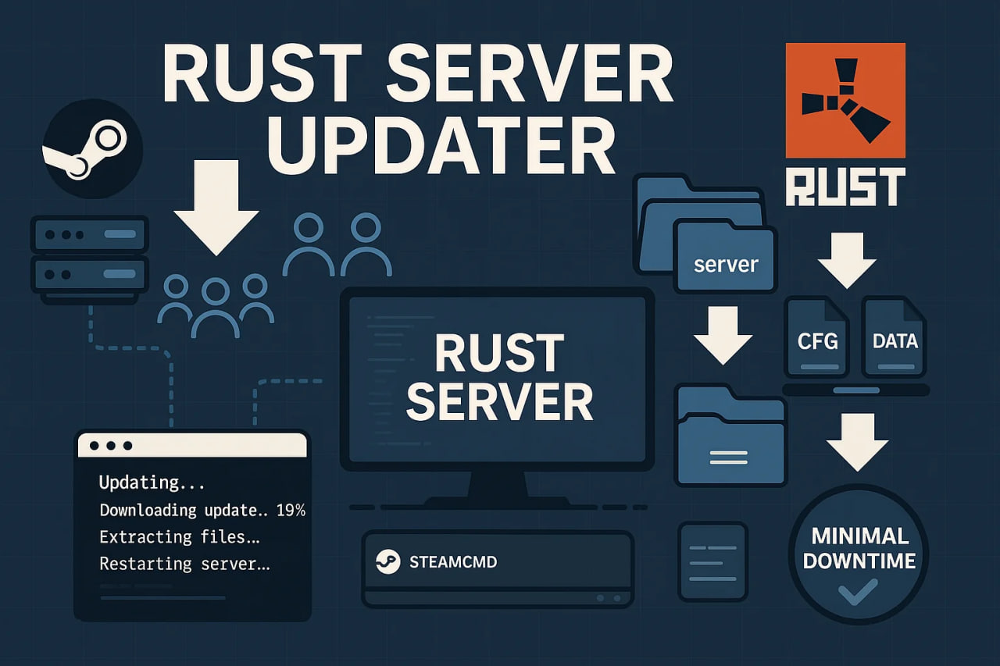

# Rust Server Updater

A utility for automatic Rust game server updates.

## Overview

This tool automates the process of updating Rust game servers through the following steps:

1. Downloads the latest server files from the official sources
2. Extracts and verifies the server packages
3. Installs or updates the server components
4. Manages SteamCMD integration for Rust server files
5. Handles the update process with minimal downtime

## Project Structure

```
/cmd          - Application entry point
/internal     - Internal project packages
```

## Usage

1. Download the latest release from [Releases](https://github.com/x-slider/rust_updater/releases)
2. Place `rust_updater_windows_amd64.exe` in either:
   - The same directory as your existing Rust server installation (for updates)
   - The directory where you want to install a new Rust server
3. Run `rust_updater_windows_amd64.exe`

The updater must be executed in the target server directory - either where an existing server is located or where you want to install a new server.

## Development

For local build:

```bash
go build -v ./cmd/
```

## Requirements

- Go 1.20 or higher
